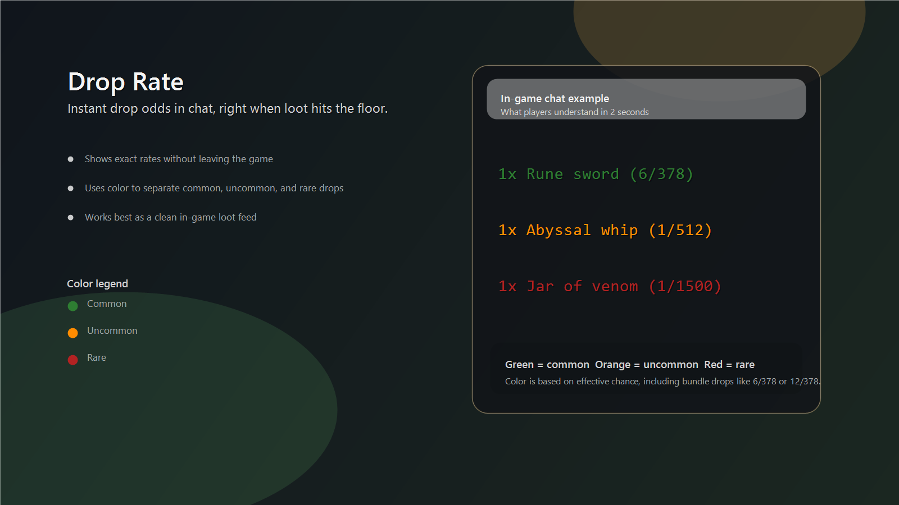

# Drop Rate Plugin
Instantly see the exact drop rate of items when monsters or bosses drop them, without leaving the game.

Created by **Pluckss**.

## Example

## Features
- Shows a chat message when a dropped item has a known drop rate.
- Supports standard rates like `1/128` and bundle rates like `6/378` or `12/378`.
- Uses color-coded chat messages to quickly separate common, uncommon, and rare drops.
- Adds a purple ultra-rare tier for especially rare drops.
- Each tier color can be customized with a color picker.
- Colors and rarity checks are based on the effective chance of the drop, including bundle drops.
- Lets you keep the raw wiki rate, convert it to an effective `1/x`, or show both in chat.
- Can optionally append a rounded percentage such as `1/100 (1%)` or `4/51 (7.84%)`.
- Lets you customize the color tier cutoffs or switch everything to neutral white text.
- Works with drop data whether it is stored as `NPC -> item` or `item -> NPC`.
- Supports both normal drop tables and the Rare Drop Table (RDT) with automatic dual lookup.
- Supports context-aware overrides for exceptions like task-based Hydra rates.
- Can optionally show possible source notes for ambiguous drops such as `Normal 1/400 | RDT 1/5012.5`.
- Includes cleaner feed options so players can reduce chat clutter.

## Config

### Display
- `Drop visibility`
  Choose between `All drops`, `Cleaner feed`, or `Rare drops only`.
- `Rate display`
  Defaults to `Raw wiki rate`. You can switch to `Effective 1/x` to convert rates like `2/222` into `1/111`, or `Raw + effective` to show both.
- `Show percentage`
  Off by default. Adds a rounded percent chance to the end of the message.
- `Rare-only minimum rate`
  Used only in `Rare drops only` mode. Example: `700` means show `1/700` and rarer.

### Filtering
- `Show bundle drops`
  Includes common multi-roll or bundled drops such as `4/115`, `6/378`, or `12/378`.
- `Hidden filler items`
  Lets you hide custom filler items in `Cleaner feed` mode with a comma-separated list.

### Appearance
- `Chat colors`
  Choose between `Tiered colors` and `Neutral white`.
- `Normal tier max`
  Tiered colors only. Rates up to this value stay in the normal color tier.
- `Rare tier min`
  Tiered colors only. Rates at or above this value use the rare color tier.
- `Ultra-rare tier min`
  Tiered colors only. Rates at or above this value use the ultra-rare purple tier.
- `Common color`
  Pick the color used for common-tier drops.
- `Uncommon color`
  Pick the color used for uncommon-tier drops.
- `Rare color`
  Pick the color used for rare-tier drops.
- `Ultra-rare color`
  Pick the color used for ultra-rare-tier drops.

### Advanced
- `Show possible sources`
  Adds extra detail for drops that can come from multiple tables or use context-sensitive rates. It does not detect the exact hidden roll.

## Useful Notes
- The plugin reads normal drop data from `src/main/resources/droprates_clean.json` at startup.
- Rare Drop Table data is loaded from `src/main/resources/rare_drop_table.json`.
- Extra context rules and alternate-table metadata live in `src/main/resources/drop_metadata.json`.
- If an item exists in both the normal table and the RDT for the same NPC, and `Show possible sources` is on, both rates are shown side by side.
- If an item and NPC combination is not in either database, no drop-rate message is shown.
- Messages appear in chat as `Quantity x Item (rate)`.
- Raids are not currently supported.