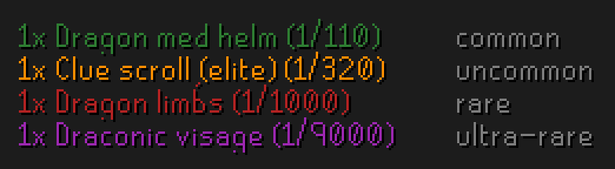
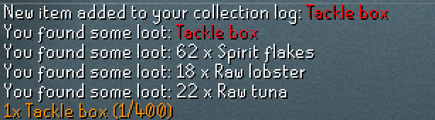
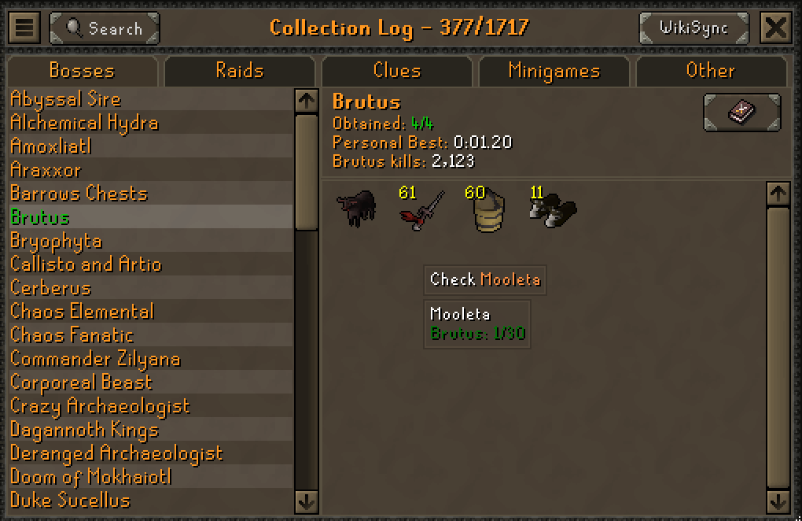
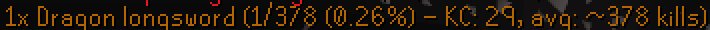
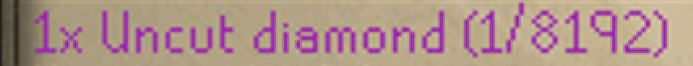

# Drop Rate

You kill something, it drops something, and the chatbox tells you how rare that was.



No alt-tab. No wiki tab. The number is just there, in a colour that tells you at a
glance whether to care. Those are four real drops from one monster, an Adamant dragon,
at the rates the plugin actually prints for them.

Made by [@Pluckss](https://github.com/Pluckss), with help from [@xTaig4](https://github.com/xTaig4).

## Why it exists

I disassembled my Group Ironman's only Toxic blowpipe by accident. No spare, nothing in the
bank. So it was back to Zulrah to grind another fang.

Zulrah kept giving me dragonstones instead. Over and over. And every single time one landed
I alt-tabbed to the wiki to check how rare it was, read a number I already knew, closed the
tab, killed it again, got another dragonstone, opened the wiki again. Wrong drop, same
lookup, every time. It drove me up the wall.

The stupid part is that the dragonstone is the rarer of the two. I kept hitting the drop I
wasn't even looking for.

So I put the number in the chatbox and stopped leaving the game.

## In chat

Every drop you pick up gets one line:

```
1x Abyssal whip (1/512)
1x Jar of Venom (1/1500)
```



The white lines are the game's. The orange one at the bottom is the plugin: the game tells
you what you got, the plugin tells you how rare it was.

The colour is the shortcut. You don't have to read the fraction to know how you did:

| Colour | Means | Default range |
|---|---|---|
| 🟢 Green | Common | up to 1/300 |
| 🟠 Orange | Uncommon | 1/300 to 1/1000 |
| 🔴 Red | Rare | 1/1000 to 1/5000 |
| 🟣 Purple | Ultra-rare | rarer than 1/5000 |

All four colours and all three cutoffs are yours to change. If you hate colours, there is
a plain white mode.

Some drops roll several times, so the wiki writes them as things like `6/378`. The plugin
does that division for you and prints `1/63`. If you switch it back to the wiki's own
wording, the colour still follows the real 1-in-63 chance, not the 6.

## In the Collection Log

Hover any item in the Collection Log and you get a list of everything that drops it, with
rates, most common source first. Sources that share a rate get grouped onto one line.



The same tooltip shows up on the clue scroll reward screen, so you can see what you nearly
got before you close the interface.

## What it knows

The data comes straight from the OSRS Wiki's own drop tables. A job runs every Monday and
compares what's bundled against the live wiki, so when Jagex changes a rate it gets caught
instead of sitting wrong for months.

- **689 monsters and bosses**, 1465 different items, 16545 rates in total
- **The Rare Drop Table**, including how Ring of Wealth and Legends' Quest change it
- **Clue caskets**, Beginner through Master, printed when you open one
- **Minigames**: Wintertodt, Tempoross, Guardians of the Rift, Soul Wars, Barbarian Assault high gamble

It also knows that not every "Cyclops" is the same Cyclops. Kill an Abyssal demon in the
Wilderness Slayer Cave and you get the Wilderness rate, not the normal one. Same for
Cyclops floors, Barbarian levels, and everything else the wiki splits into separate tables.

Everything ships inside the plugin. It never touches the network while you play.

## Settings

Nothing is required. Install it and it works. But if you want to tune it:

### Display

- **Drop visibility** — every drop, or notable drops only.
- **Rate display** — `1/111` (tidied up), `2/222` (exactly as the wiki writes it), or both.
- **Show percentage** — adds `(1%)` on the end. Off by default.
- **Show source hints** — when an item can come from two tables, shows both:
  `Normal 1/400, RDT 1/5012.5`. Off by default.
- **Show all table variants** — when a monster has several drop tables and the kill can't be
  pinned to one, shows all of them, labelled. On by default.
- **Show kill counter** — puts your kill count next to the drop, and how many kills that
  drop takes on average:

  `1x Abyssal whip (1/512 — KC: 203, avg: ~512 kills)`

  Read it left to right: this whip is a 1 in 512 drop, it took you 203 kills, and it takes
  about 512 kills on average. The `~` just means "about". 203 is well under 512, so you got
  this one early. A kill count **above** the average means it took you longer than usual.

  

  The count is your real one, the same number RuneLite already tracks from the in-game
  `Your ... kill count is:` message, so it survives restarts. Things that never print that
  message fall back to counting the current session only, and say so: `KC: 8 this session`.

- **Kill counter min rarity** — only show the counter for drops rarer than this.

### Filtering

- **Show bundle drops** — include multi-roll drops like `6/378`. On by default.
- **Hidden filler items** — a comma-separated list of things you never want to hear about.
- **Min item value (gp)** — hide drops worth less than this on the GE. Pets and other
  untradeables are never hidden by this.
- **Minimum rarity to show in chat** — how rare a drop has to be before it is printed.
  Pick a tier and you get that tier and everything rarer: `Uncommon` stops the common
  green lines, `Rare` prints only red and purple. `Common`, the default, prints
  everything. These are the same four tiers the colours use, so if you move a tier
  boundary under **Appearance** this filter moves with it.

### Notifications

- **Notify on rare drops** — a desktop notification when something rare lands. Uses your
  normal RuneLite notification settings, so you control the popup, the sound, and the
  screen flash. Handy when you're alt-tabbed. Off by default.
- **Notification threshold** — how rare it has to be. `1000` means 1/1000 and rarer.

### Appearance

- **Color style** — tiered colours, or neutral white.
- **Common tier max** / **Rare tier minimum** / **Ultra-rare tier minimum** — where the
  colours change.
- **Common / Uncommon / Rare / Ultra-rare color** — pick each one.
- **Fit standard chatbox** — the standard chatbox has a pale parchment background that
  bright text disappears into. While it's open, each colour is darkened just enough to stay
  readable, keeping your hue. The transparent chatbox uses your colours exactly as picked.
  On by default.

  

### Tooltips

- **Collection log tooltips** — on by default.
- **Clue reward tooltips** — on by default.
- **Hide for obtained items** — skip the tooltip for things you already have. Collection Log
  only. Off by default.

## Things worth knowing

- Raids aren't covered. Raid uniques and skilling pets do appear in the Collection Log
  tooltip, but **without** a rate, and that's deliberate. Those drops depend on your
  contribution, your invocation level, or your skill level, so no honest fixed number
  exists. A made-up one would be worse than nothing.
- If an item and a monster aren't in the data, nothing is printed. You get silence, not a
  guess.
- Some rates have decimals, like `1/30.3`. Those are real. Clue caskets roll a variable
  number of times, so the per-casket chance is a weighted average, exactly as the wiki
  shows it.

## Credits

Built and maintained by [@Pluckss](https://github.com/Pluckss).

[@xTaig4](https://github.com/xTaig4) rebuilt the drop data on the OSRS Wiki's structured
Bucket API with a weekly freshness check, and added per-version drop table matching by
NPC id.

Drop rate data comes from the [OSRS Wiki](https://oldschool.runescape.wiki/), licensed
CC BY-NC-SA 3.0.

## For developers

<details>
<summary>Where the data lives and how it's rebuilt</summary>

All data files sit in `src/main/resources/`:

| File | What's in it |
|---|---|
| `droprates_clean.json` | Normal NPC drop tables |
| `rare_drop_table.json` | Rare Drop Table, with Ring of Wealth and Legends' Quest variants |
| `npc_versions.json` | Monsters with more than one drop table, keyed by NPC id |
| `drop_metadata.json` | Name aliases and context rules |
| `minigame_droprates.json` | Minigame reward rates, keyed by RuneLite's event name |
| `clue_droprates.json` | Clue reward rates per tier |
| `special_droprates.json` | Bosses whose drops the wiki stores outside a normal drop table |

The first three are generated, never hand-edited:

```
python tools/crawl_bucket.py diff       # what would change vs. the committed files
python tools/crawl_bucket.py generate   # rewrite them
python tools/crawl_bucket.py check      # exit 1 if they're stale (CI runs this weekly)
```

They come from the wiki's Bucket API — the same structured data the wiki renders its own
drop tables from — so a new template on the wiki can't silently swallow a row.

</details>
